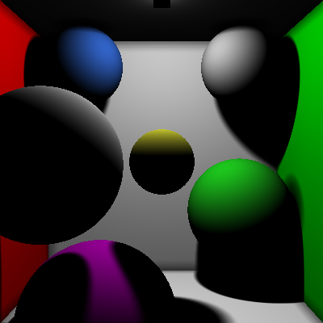
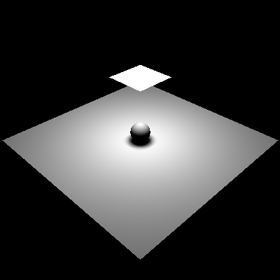
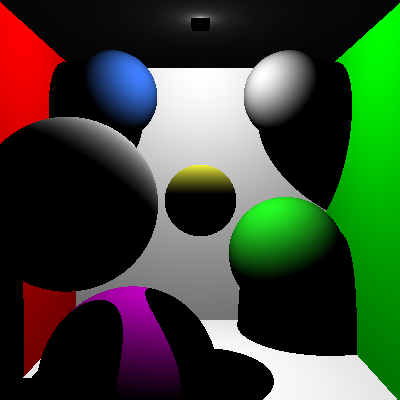
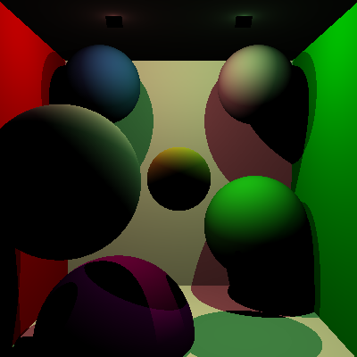
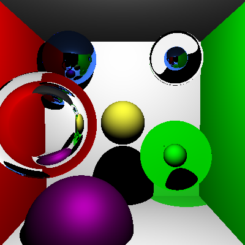

Taken from repo in class (completed by self): 
1: https://github.com/CIS-461-2019/homework-01-basic-ray-intersection-engine-tatran5
2: https://github.com/CIS-461-2019/homework-02-recursive-ray-tracing-tatran5
3: https://github.com/CIS-461-2019/homework-03-soft-shadows-and-ambient-occlusion-tatran5
!!!NOTE: If you want to run the code, the code is in the folder rayTracerCIS461

What I created (or implement -- which would be marked I):
- Qt Widgets Application
- Classes: Ray, Camera, Intersection, Transform, Primitive, Shape, Scene, Sphere, SquarePlane, Light, PointLight, Material (and subclasses - LambertMaterial, BlinnPhongMaterial, SpecularReflectionMaterial, SpecularTransmissionMaterial), AreaLight, Disc, SoftShadows 
- Functions (I): everything in WarpFunctions

Result:

Ambient occlusion & soft shadow:

Soft shadow:

Ambient occlusion:

Lambert:

Lambert with multiple lights:

Specular & blinn phong:

