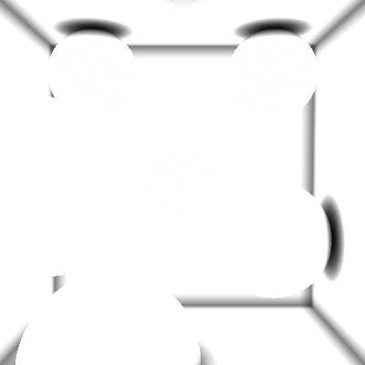
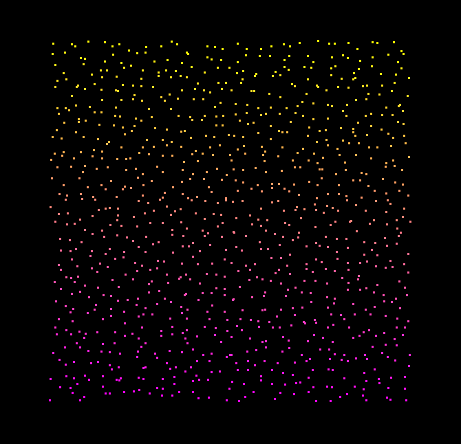
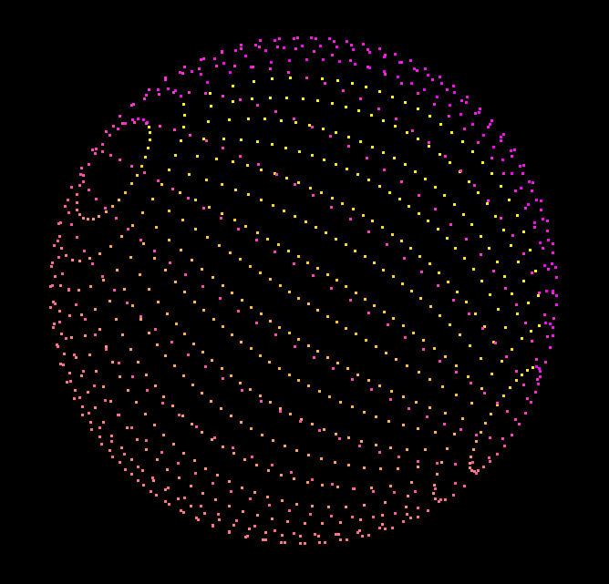
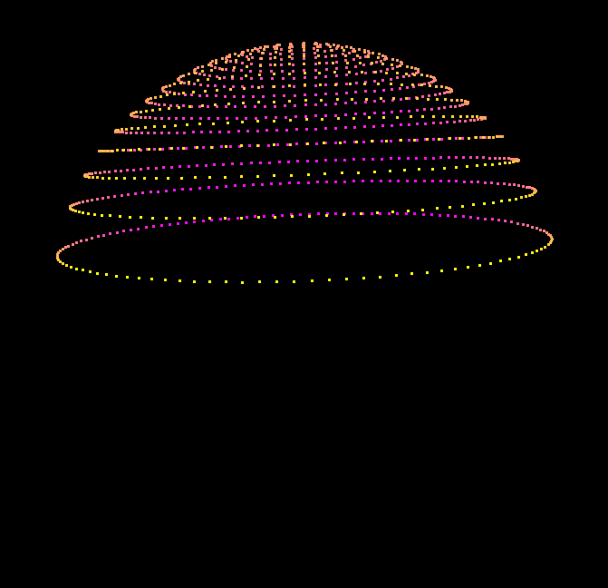
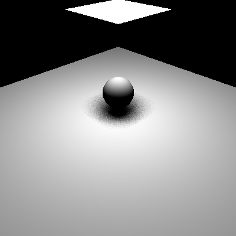
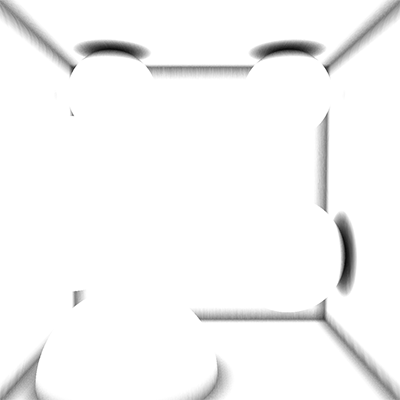
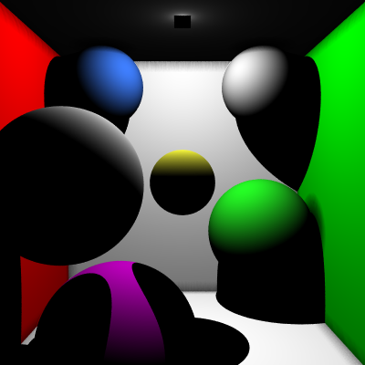

!!!NOTE: If you want to run the code, the code is in the folder rayTracerCIS461

Tea Tran's result

**University of Pennsylvania, CIS 561: Advanced Computer Graphics, Homework 2**

Ray Tracer Part III: Sampling Functions
======================

**University of Pennsylvania, CIS 561: Advanced Computer Graphics, Homework 3**

Overview
------------
You will implement a collection of functions in order to generate sample points
on the surfaces of objects, which will help you to implement the beginning of
your path tracer later on. Sampling the surfaces of different shapes is very
important in a path tracer; not only does one have to cast rays in random
directions within a hemisphere, but if one wants to sample rays to area
lights, one needs to sample points on the surfaces of these lights.

Once you have implemented the various sampling functions, you will apply some
of them in your ray tracer to implement effects such as soft shadows and ambient
occlusion. We have provided base code in which to test your sampling functions,
but you will ultimately continue to work with your ray tracer code as well.

Useful Reading
---------
We highly recommend you refer to the textbook when implementing this homework
assignment. Chapter 7 and Chapter 13 of PBRT in particular are quite relevant.

Square Sampling Functions (10 points)
--------
In `sampler.cpp`, you will find a function called `generateSamples`. In this
function, fill out the switch statement cases for generating grid-aligned
samples and stratified samples. Each of the samples generated should fall within
the range [0, 1) on the X and Y axes. You may refer to the method used to
generate purely random samples to see how to use the provided `rng32` random
number generator. The [PCG web site](http://www.pcg-random.org/) goes into
detail as to why the RNG32 is a superior random number generator to, say,
`std::rand()`.

Sample Warping Functions (30 points)
------
In `warpfunctions.cpp`, you will find a collection of functions that throw
runtime exceptions:
* `squareToDiskUniform`
* `squareToDiskConcentric`
* `squareToSphereUniform`
* `squareToSphereCapUniform`
* `squareToHemisphereUniform`
* `squareToHemisphereCosine`

Replace the runtime exceptions with code that takes the input square sample and
warps it to the surface of the shape indicated by the function name. For the
disk warp functions, there are two implementations. For
`squareToDiskUniform`, implement a "polar" mapping where one square axis maps
to a disc radius and the other axis maps to an angle on the disc. For
`squareToDiskConcentric`, implement [Peter Shirley's warping method](https://pdfs.semanticscholar.org/4322/6a3916a85025acbb3a58c17f6dc0756b35ac.pdf)
that better preserves relative sample distances.

Likewise, there are two implementations for hemisphere sampling. Unlike the disc
sampling functions, these methods are meant to have very different distributions
of samples. For `squareToHemisphereUniform`, you must distribute all square
samples uniformly across the hemisphere surface. For `squareToHemisphereCosine`,
you must bias the warped samples toward the pole of the hemisphere and away from
the base.

If you refer to `utils.h`, you will find some useful values defined, such as
`INV_PI`, which make your computations slightly faster.

Sample Warping Probability Density Functions (20 points)
-------------
As you implemented the warping functions above, you likely noticed additional
functions with the suffix `PDF`. You must implement these functions so that they
return the result of the probability density function associated with each
warping method, using the sample point as input to the PDF. Note that most of
the PDFs will return a constant value regardless of the input point, but some
of them _are_ dependent on it. Once you have implemented all of the sample
warping functions, you can test your PDF implementations by pressing the button
at the bottom of the GUI. Each of your PDFs should evaluate to approximately
1.0, by definition.

Sphere Cap Warping
------------
PBRT does not explicitly explain how to constrain warped samples to a subsection
of a sphere, so we'll give you a hint: consider the formula for the Z coordinate
of a point on a sphere, and consider how to shrink its possible range based on
some angle _theta_ between 0 and 180 degrees.

Example Images
-------------
Below are images of the images you should expect to generate using 1024 samples
and, unless otherwise noted, grid sampling. Some of the images have had their
camera moved for better illustration of point distribution.

Grid Sampling

Stratified Sampling

Disc Warping (Uniform)

Disc Warping (Concentric)

Sphere

Sphere Cap (150 degrees)

Hemisphere (Uniform)

Hemisphere (Cosine Weighted)

`AreaLight`s, `Disc`s, and Soft Shadows (15 points)
------------
Once you've implemented the functions to sample the surfaces of squares and
discs, you can open up your ray tracer project and add an `AreaLight` class
which inherits from your `Light` class. This class will implement its shadow
testing function a little differently. Rather than being treated as a single
point in space that can be only fully occluded or unoccluded, you will treat it
as an area in space that emits light, which can be partially occluded. Taking
N samples (where N is any large number, such as 100), test to see if a point
in the scene can see a sampled point on the surface of the light source,
changing the sampled point N times. Average the result of these samples to get
your shadow intensity.

An `AreaLight` will have to know what `Shape` it is. We only require that
you support `AreaLight`s that are `SquarePlane`s and `Disc`s.
You will also have to implement a `Disc` class, which is identical to a
`SquarePlane` but has a radius of 0.5 rather than a side length of 1.

Once you have created your implementations of these classes and functions, you
can test them by setting up a simple scene with the following parameters:
* A `SquarePlane` with 0 translation, a rotation of -90 degrees about the
X-axis, and a scale of (10, 10, 1). This will act as the floor.
* A `Sphere` that is translated by 1 in the Y-direction, with otherwise unchanged
transform data.
* An `AreaLight` with a `SquarePlane` shape translated by 3.5 in the
Y-direction, a rotation of 90 degrees about the X-axis, and a scale of (2, 2, 1).

Depending on which sampling technique you use (random vs grid vs stratified),
you will get one of these images:

Random sampling:

Grid sampling:

Stratified sampling:

Ambient Occlusion (15 points)
-----------
Once you have implemented uniform hemisphere sampling, you can add ambient
occlusion to your ray traced renders. Ambient occlusion is a method of
approximating how much ambient lighting reaches a particular point in a scene
without fully computing expensive recursive path tracing operations. To
compute this effect for a point in a scene, one creates an imaginary hemisphere
aligned with the point's surface normal, and samples N rays within the
hemisphere. Compute the intersection of each ray with the scene, and if that ray
intersects the scene before traveling a certain distance (adjustable based on
artistic parameters), it counts as a "black" ray. If not, it counts as a "white"
ray. Average all N rays together to get a greyscale value by which to attenuate
the actual lighting at the point in the scene.

An example of ambient occlusion applied to `cornell_box.json` (and only ambient occlusion, no other lighting
effects are present):

To implement ambient occlusion, you will need to be able to transform a ray from
"unit hemisphere space" to "world space", where "unit hemisphere space" is
a hemisphere aligned with the Z-axis. If you generate a ray in this space,
you'll need to rotate it so that it is within a hemisphere that is aligned to
the world-space normal of the point of intersection. To do this, you'll need
to compute a tangent and bitangent vector for any point on the surface of a
`Shape` and use those vectors along with the surface normal to define a set of
axes to which to align your hemisphere. If you create the matrix on slide 33 of
[this slide set](https://docs.google.com/presentation/d/e/2PACX-1vSV2AaTGaayLvW9VP--SkSKgnTMWVm-8SFuU5PgebmmI637QPQ6BfhYJx9KIl-MVmeNLooGAIiuLMn6/pub?start=false&loop=false&delayms=60000&slide=id.g2571e53027_0_276)
you can align your rays appropriately.

The method of sampling several rays from a hemisphere and averaging their
illumination function results together is the basis of a path tracer, which you
will begin to implement in a couple more weeks. Implementing ambient occlusion
in your ray tracer, while not as photorealistic as a path tracer, will help
you to understand some of the techniques you'll be using in the path tracer.

Below is an image of `cornell_box.json` rendered as usual, but multiplied with its ambient occlusion from above. The two AO images were generated using a ray search distance of 0.5, with 256 samples per AO hemisphere.

Code Style (10 points)
----------
For the ray tracer assignments in this course, we will be grading you on coding
style since you'll be writing nearly all of the code yourself. We will be
following the style guide defined in CIS 560; you can find it [here](https://www.cis.upenn.edu/~cis460/17fa/styleguide.html) if you need to
review it. Part of this style guide is based on the design decisions made in
`Physically Based Rendering`, so adhering to it now will help you to better
understand PBRT's code once we begin the path tracer.

Submitting your project
--------------
Along with your project code, make sure that you fill out this `README.md` file
with your name and PennKey. __Be sure to include a render of `cornell_box_2lights_simple.json` with soft shadows and ambient occlusion.__ You should use at least 100 samples for both your shadow and ambient occlusion calculations.

Rather than uploading a zip file to Canvas, you will simply submit a link to
the committed version of your code you wish us to grade. If you click on the
__Commits__ tab of your repository on Github, you will be brought to a list of
commits you've made. Simply click on the one you wish for us to grade, then copy
and paste the URL of the page into the Canvas submission form.

